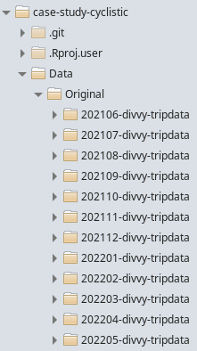

# case-study-cyclistic

Case study for Google Data Analytics Certificate's capstone project.

### Initial considerations

Annual members are much more profitable than casual riders.

The insights from the analysis could clarify the differences between annual 
members and casual riders to design marketing strategies aimed at converting 
casual riders into annual members.

Customers who purchase single-ride or full-day passes are referred to as casual riders. Customers who purchase annual memberships are Cyclistic members.

Understand how do annual members and casual riders use Cyclistic bikes 
differently. 

### Data

```{r message=FALSE}
setwd("/home/vitor/RStudio-projects/case-study-cyclistic")
Sys.setlocale("LC_ALL", "C")
```


The original data is available at: https://divvy-tripdata.s3.amazonaws.com/index.html
The data licence can be found here: https://ride.divvybikes.com/data-license-agreement

The data was collected by the company and was organized for this analysis in a directory to keep the original data unchanged. Each month has a subdirectory 
containing a CSV file, comprehending the last 12 months, from June 2021 to May 
2022.



The merging and cleaning is on cyclistic_cleaning.Rmd, which saves the file 
"df.Rda" on "Data" directory.

```{r}
load("Data/df.Rda")
```


### Process Data

```{r message=FALSE, warning=FALSE}
library(tidyverse)
library(lubridate)
# library(mapview)
# library(maps)
```


Create plots comparing members and casual users.

comparing trip count

```{r}
ggplot(data = df) +
    geom_bar(fill = "blue", width = 0.5, mapping = aes(x = member_casual))
```

```{r}
ggplot(data = df) +
    geom_bar(position = position_dodge2(width = 1)
             , width = 0.8, mapping = aes(x = weekday, fill = member_casual))
```

On weekends there is a higher amount of casual riders' trips than members', 
while on weekdays there is a higher count on members' trips.
This suggests that members use bikes while commuting.

This can be further explored by comparing the time of the day when trips happen 
for both groups. The ended_at, time when trip ends, would reflect the starting 
work hour, while started_at, the time when work ends.

```{r}
weekday_plot <- ggplot(data = df) +
    geom_histogram(position = position_dodge(), bins = 24) +
        facet_wrap("weekday")

weekday_plot + 
    aes(x = hms::as_hms(ended_at), fill = member_casual)
```

```{r}
weekday_plot + 
    aes(x = hms::as_hms(started_at), fill = member_casual)
```


```{r}
ggplot(data = df) +
    geom_histogram(position = position_dodge(),
             mapping = aes(x = ended_at, fill = member_casual))
```
 

```{r}
month_plot <- ggplot(data = df) +
    geom_bar(position = position_dodge2()) +
    facet_wrap("month_year")

month_plot + 
    aes(x = day, fill = member_casual)
```


analyze duration
```{r}
ggplot(data = df[df$trip_duration < 3600,]) +
    geom_histogram(position = position_dodge()) +
    aes(x = trip_duration, fill = member_casual)
    
```


<!-- analyze geographical coordinates -->

```{r}
# set.seed(111)
# 
# to_map_df <- sample_n(df, 1000)
# 
# mapview(to_map_df, xcol = "start_lng", ycol = "start_lat", crs = 4269, 
#         grid = FALSE)

```

```{r}
# m <- ggplot(to_map_df, aes(x = start_lng, y = start_lat)) +
#     geom_point()
# 
# m
```

```{r}
# library(ggmap)
```

```{r}
# test_map <- qmplot(x = start_lng, y = start_lat, data = to_map_df)
```

```{r}
# plot(test_map)
```

