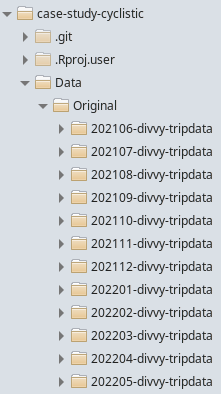

```{r setup, include=FALSE}
knitr::opts_chunk$set(cache = TRUE, message = FALSE, warning = FALSE)
```

Case study for Google Data Analytics Certificate's capstone project.


## Initial considerations

Annual members are much more profitable than casual riders.

The insights from the analysis could clarify the differences between annual 
members and casual riders to design marketing strategies aimed at converting 
casual riders into annual members.

Customers who purchase single-ride or full-day passes are referred to as casual riders. Customers who purchase annual memberships are Cyclistic members.

Understand how do annual members and casual riders use Cyclistic bikes 
differently. 


## Data

The original data is available at: https://divvy-tripdata.s3.amazonaws.com/index.html
The data licence can be found here: https://ride.divvybikes.com/data-license-agreement

The data was collected by the company and was organized for this analysis in a directory to keep the original data unchanged. Each month has its own subdirectory 
containing a CSV file, comprehending the last 12 months, from June 2021 to May 
2022.




The merging and cleaning is on cyclistic_cleaning.Rmd, which saves the file 
"df.Rda" on "Data" directory.

```{r results='hide'}
wd <- "/home/vitor/RStudio-projects/case-study-cyclistic"
input_file <- "Data/df.Rda"

setwd(wd)
Sys.setlocale("LC_ALL", "C")
load(input_file)
```


## Analysis

```{r}
library(tidyverse)
library(lubridate)
library(vtable)
```


### Members and casual users comparison.

View column names to guide the analysis.

```{r}
colnames(df)
```

```{r}
sumtable(df[c("rideable_type", "member_casual", "trip_duration")], 
         add.median = TRUE)
```

#### Trip duration


Values smaller than 1 minute are excluded, since they could represent false 
starts or users trying to re-dock, according to the data description at 
https://ride.divvybikes.com/system-data.

Duration values longer than one day are considered as lost or stolen bikes, according to https://help.divvybikes.com/hc/en-us/articles/360033484791-What-if-I-keep-a-bike-out-too-long-. In this analysis, they will be referred as missing.

Trip duration longer than one day by customer type:

```{r}
ggplot(data = df[df$trip_duration > 86400, ]) +
    geom_bar(width = 0.5, mapping = aes(x = member_casual, fill = rideable_type))
```

There are no electric bikes missing, this can be due to battery depletion or 
some tracking device included only on this model.
- Discuss with the technical team to find out what is avoiding the electrical 
bikes to go missing and if it is a device that can be installed on the other 
model.

Trip duration values higher than one day will be not considered from now on.

```{r}
df <- df[df$trip_duration <= 86400, ]
```


Comparing trip duration by customer type:

```{r}
df %>% group_by(member_casual) %>% 
    summarise(mean_duration = hms::as_hms(round(mean(trip_duration))),
              median_duration = hms::as_hms(round(median(trip_duration))))
```
 
 Plotting trip duration shorter than 1 hour:
 
```{r fig.width=14}
ggplot(data = df[df$trip_duration < 3600,]) +
    geom_histogram(position = position_dodge()) +
    aes(x = trip_duration, fill = member_casual) +
    scale_x_continuous(breaks = seq(0, 3600, 300), labels = seq(0, 60, 5),
                       name = "minutes")
```

Comparing trip duration for both customer types by day of the week.

```{r}
dur_day <- df %>% 
    group_by(day_of_week, member_casual) %>% 
    summarise(mean_duration = hms::as_hms(round(mean(trip_duration))))

ggplot(dur_day, aes(x = day_of_week, y = mean_duration, fill = member_casual)) +
    geom_bar(stat = "identity", position = position_dodge2(width = 1)) +
    labs(title = "Average trip duration for each day of the week") +
    theme(legend.title = element_blank())
```


#### Trip count

```{r}
ggplot(data = df) +
    geom_bar(width = 0.5, mapping = aes(x = member_casual,
                                        fill = rideable_type)) +
    labs(title = "Number of casual and members rides", 
         subtitle = "with rideable type proportion", x = "")
```


```{r}
ggplot(data = df) +
    geom_bar(position = position_dodge2(width = 1),
             width = 0.8, mapping = aes(x = day_of_week, fill = member_casual)) +
    labs(title = "Number of casual and members rides in each day of the week" )
```

Since the total number of member trips is higher than casual trips, their behavior 
would be better expressed in percentage of total trips for each group.


```{r}
day_of_week_df <- as.data.frame(table(df$member_casual, df$day_of_week))
colnames(day_of_week_df) <- c("member_casual", "day_of_week", "trips")

trip_count <- day_of_week_df %>% 
    group_by(member_casual) %>% 
    summarise(total_trips = sum(trips))

day_of_week_df <- left_join(day_of_week_df, trip_count) %>% 
    mutate(percent = 100 * trips / total_trips)


ggplot(day_of_week_df, aes(x = day_of_week, y = percent, fill = member_casual)) +
    geom_bar(stat = "identity", position = position_dodge2(width = 1)) +
    labs(title = "Percentage of rides for each day of the week") +
    theme(legend.title = element_blank())
```

Casual riders use the service more on weekends and members on weekdays.
This suggests that members use bikes while commuting.

This can be further explored by comparing the time of the day when trips happen 
for both groups.


```{r fig.width=14}
hour_df <- df %>% 
    group_by(member_casual, day_of_week, start_int_hour) %>% 
    summarise(total_hour = length(member_casual)) %>% 
    left_join(trip_count) %>% 
    mutate(percent = 100 * total_hour / total_trips)

total_hour_df <- hour_df %>% 
    mutate(day_of_week = ifelse(grepl("S(at|un)", day_of_week), 
                            "weekend", "weekday")) %>% 
    group_by(member_casual, day_of_week, start_int_hour, total_trips) %>% 
    summarise(total_hour = sum(total_hour)) %>% 
    mutate(percent = 100 * total_hour / total_trips)

ggplot(data = total_hour_df) +
    geom_bar(position = position_dodge(), stat = "identity") +
    facet_wrap("day_of_week", dir = "v") +
    scale_x_continuous(breaks = seq(0, 24, 3),
                       minor_breaks = seq(0, 24)) +
    aes(x = start_int_hour, y = percent, fill = member_casual) +
    labs(x = "Hour", y = "Percent") +
    theme(legend.title = element_blank(),
          panel.spacing.x = )
```

The shape of the plots are very different for weekends and weekdays and they 
confirm that members use the service more to commute to work than casuals, while casuals use more on weekends than members.


analyze months

```{r fig.width=14}
month_df <- df %>% 
    group_by(member_casual, month_year) %>% 
    summarise(total_month = length(member_casual)) %>% 
    left_join(trip_count) %>% 
    mutate(percent = 100 * total_month / total_trips)

ggplot(data = month_df) +
    geom_bar(position = position_dodge(), stat = "identity") +
    aes(x = month_year, y = percent, fill = member_casual)
```
 
### Appendix

```{r fig.width=14}
ggplot(data = df) +
    geom_bar(position = position_dodge()) +
    facet_wrap("day_of_week") +
    scale_x_continuous(breaks = seq(0, 24, 3)) +
    aes(x = start_int_hour, fill = member_casual) +
    labs(x = "Hour", y = "Number of trips") +
    theme(legend.title = element_blank())
```


```{r fig.width=14}
ggplot(data = hour_df) +
    geom_bar(position = position_dodge(), stat = "identity") +
    facet_wrap("day_of_week") +
    scale_x_continuous(breaks = seq(0, 24, 3),
                       minor_breaks = seq(0, 24)) +
    aes(x = start_int_hour, y = percent, fill = member_casual) +
    labs(x = "Hour", y = "Percent") +
    theme(legend.title = element_blank())
```

```{r fig.width=14}
day_df <- df %>% 
    group_by(member_casual, month_year, day) %>% 
    summarise(total_day = length(member_casual)) %>% 
    left_join(trip_count) %>% 
    mutate(percent = 100 * total_day / total_trips)

ggplot(data = day_df) +
    geom_bar(position = position_dodge(), stat = "identity") +
    facet_wrap("month_year") +
    aes(x = day, y = percent, fill = member_casual)
```